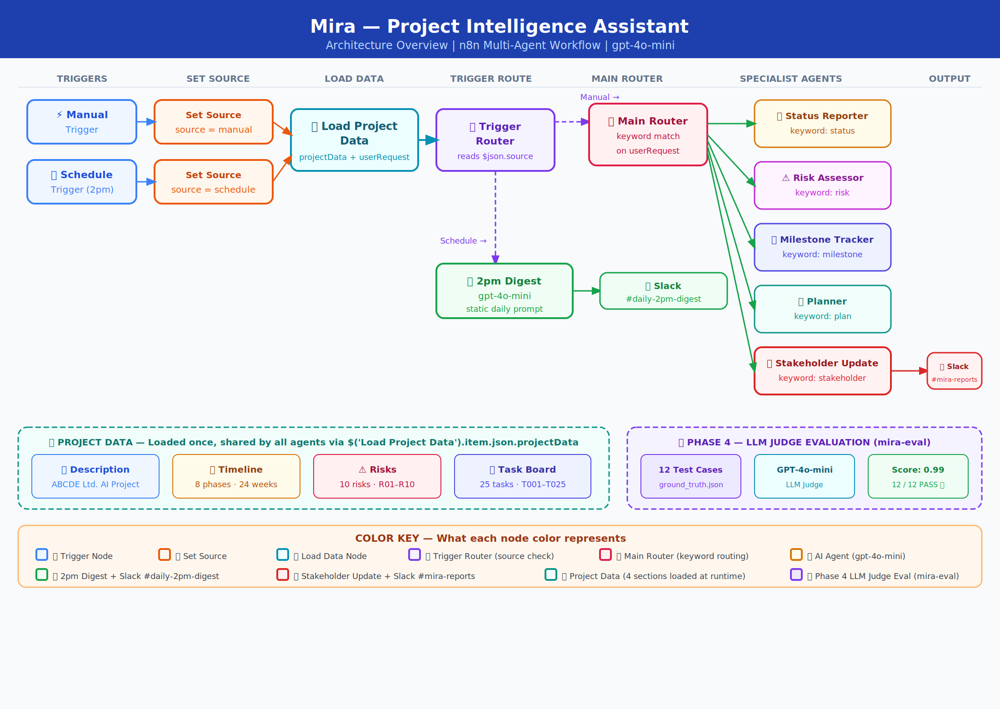

# 🤖 Mira — Project Intelligence Assistant

> AI-powered multi-agent system that automates project planning, risk assessment, status reporting, milestone tracking, and stakeholder updates — built in n8n with gpt-4o-mini.

**Built by:** Praveen Kumar Jatta | Senior TPM | PMP® CSPO® SMC®
**Client Scenario:** Nexora Pvt. Ltd. → ABCDE Ltd. AI Adoption Project
**Stack:** n8n · OpenAI gpt-4o-mini · Slack · Python · DeepEval · Langfuse

---

## 🧩 The Problem It Solves

PMs and TPMs at Nexora spend **3–4 hours per project** manually creating plans, compiling risk assessments, and writing weekly status reports. Missed milestones are discovered only in retrospectives. Stakeholder updates are inconsistent.

Mira eliminates all of that.

One workflow. Five specialist agents. Two delivery channels. Fully automated.

---

## 🏗️ Architecture



```
Manual Trigger  ──→  Set Source (manual)  ──┐
                                             ├──→  Load Project Data  ──→  Trigger Router
Schedule Trigger ──→  Set Source (schedule) ──┘         │                       │
                                                         │               ┌───────┴────────┐
                                                         │          Manual branch    Schedule branch
                                                         │               │                │
                                                         │          Main Router      2pm Digest Agent
                                                         │               │                │
                                                         │     ┌─────────┼──────────┐    Slack
                                                         │     ↓         ↓          ↓  #daily-2pm-digest
                                                         │  Planner  Risk Assessor  Status Reporter
                                                         │  Milestone Tracker  Stakeholder Update
                                                         │                          │
                                                         └──────────────────────────┘
                                                                         │
                                                                    Slack #mira-reports
                                                                         │
                                                              ┌──────────┴──────────┐
                                                              │   Merge - All Agents │
                                                              └──────────┬──────────┘
                                                                         │
                                                              ┌──────────┴──────────┐
                                                              │ Langfuse Observability│
                                                              │  (HTTP Request node)  │
                                                              └─────────────────────┘
```

---

## 🤖 The Five Specialist Agents

| Agent | Trigger Keyword | What It Does |
|-------|----------------|--------------|
| 📋 **Status Reporter** | `status` | Reads task board, generates sprint status with blockers |
| ⚠️ **Risk Assessor** | `risk` | Analyzes project risks R01–R10, generates risk matrix |
| 🏁 **Milestone Tracker** | `milestone` | Tracks timeline progress, flags upcoming milestones |
| 🗓️ **Planner** | `plan` | Ingests project description, generates phased project plan |
| 📧 **Stakeholder Update** | `stakeholder` | Writes executive-friendly Sprint update email → Slack |
| 🤖 **2pm Digest** | Schedule (2pm daily) | Auto-generates full project digest → #daily-2pm-digest |

All agents use **gpt-4o-mini** and are grounded in the same project data loaded once at runtime.

---

## 📦 Project Data

The workflow ingests 4 data sources for **ABCDE Ltd. AI Adoption Project** (a logistics company adopting AI):

| Section | Contents |
|---------|----------|
| 📄 **Description** | Company overview, goals, focus areas |
| 📅 **Timeline** | 8 phases, 24 weeks (Initiation → Monitoring) |
| ⚠️ **Risks** | 10 risks (R01–R10) with impact & mitigation |
| 📋 **Task Board** | 25 tasks (T001–T025): 5 Done, 3 In Progress, 16 To Do, 1 Blocked |

> **Ground truth:** T024 (Security review of AI infrastructure) = BLOCKED, awaiting security team.

---

## 🔀 Routing Logic

```
userRequest.toLowerCase() contains...
  "status"      → Status Reporter
  "risk"        → Risk Assessor
  "milestone"   → Milestone Tracker
  "plan"        → Planner
  "stakeholder" → Stakeholder Update → Slack #mira-reports

$json.source === "schedule" → 2pm Digest → Slack #daily-2pm-digest
```

---

## 📊 Baseline Test Results (12 Tests)

| Test | Agent | Input | Result |
|------|-------|-------|--------|
| T1 | Planner | Project plan request | ✅ PASS |
| T2 | Planner | Vague chatbot plan | ✅ PASS |
| T3 | Risk Assessor | Full risk assessment | ✅ PASS |
| T4 | Risk Assessor | Vague risk request | ✅ PASS |
| T5 | Status Reporter | Sprint 3 status | ✅ PASS |
| T6 | Status Reporter | No task data | ✅ PASS |
| T7 | Risk Assessor | Top 3 risks | ✅ PASS |
| T8 | Milestone Tracker | Blocked/at-risk tasks | ✅ PASS |
| T9 | Planner | 2-week no-detail plan | ✅ PASS |
| T10 | Status Reporter | Task count summary | ✅ PASS |
| T11 | Milestone Tracker | Next 2 weeks milestones | ✅ PASS |
| T12 | Stakeholder Update | Sprint 2 email | ✅ PASS |

**Baseline Score: 10/12 PASS | Overall: 0.89/1.00**

**Final Score after Prompt Engineering: 12/12 PASS ✅ | Overall: 0.87/1.00**

---

## 🔬 Phase 4 — LLM Judge Evaluation

Evaluated using **DeepEval + gpt-4o-mini** as LLM judge across 3 metrics:

| Metric | Description |
|--------|-------------|
| 🎯 Groundedness | Output grounded in actual project data |
| ✅ Completeness | Covers expected keywords & pass criteria |
| 🔍 Accuracy | Correct info, avoids must-not-contain phrases |

### Fix Ladder Applied

| Level | Approach | Used? |
|-------|----------|-------|
| **L1** | 🔧 Prompt Engineering | ✅ Solved both T5 + T12 |
| L2 | 🔗 Pipeline Restructuring | ⏭️ Not needed |
| L3 | 🔄 Model Swapping | ⏭️ Not needed |
| L4 | 📚 RAG / Better Grounding | ⏭️ Not needed |
| L5 | 🎯 Fine-Tuning | ⏭️ Not needed |

> See [mira-eval](https://github.com/praveenjatta/mira-eval) for the full evaluation framework.

---

## 📡 Phase 5 — Observability with Langfuse

Mira integrates **Langfuse** for real-time observability and tracing of all agent executions.

### How It Works

```
All 6 Agents ──→ Merge - All Agents ──→ Langfuse Observability (HTTP Request) ──→ Langfuse Cloud
```

A single **HTTP Request node** connected after a **Merge node** captures all agent outputs and sends them to Langfuse automatically on every workflow run.

### What Langfuse Captures

| Field | Description |
|-------|-------------|
| 🔤 **Name** | The user request (first 50 chars) |
| 📥 **Input** | Full userRequest sent to the agent |
| 📤 **Output** | Complete agent response |
| ⏱️ **Timestamp** | Exact execution time |
| 🌍 **Environment** | default |

### Observability Results

| Metric | Value |
|--------|-------|
| Total Traces | 12 |
| All 12 Test Cases | ✅ Traced |
| Langfuse Project URL | [View Traces](https://us.cloud.langfuse.com/project/cmrs8fjql03fnad0dyiy3fwwu/traces) |

### Screenshots

| Screenshot | Description |
|-----------|-------------|
| `Langfuse_Home_Dashboard.png` | 12 total traces tracked |
| `Langfuse_Tracing_Page.png` | All 12 traces with input/output |
| `Langfuse_Trace_Detail.png` | Individual trace detail view |
| `Langfuse_Chart_View.png` | Trace activity over time |

> Full trace export available in `docs/Langfuse_Traces_Export.csv`

> 🔗 **Live Langfuse Traces:** [View all 12 traces](https://us.cloud.langfuse.com/project/cmrs8fjql03fnad0dyiy3fwwu/traces)

---

## 💰 Cost Analysis

| Component | Model | Est. Cost/Run |
|-----------|-------|--------------|
| 5 specialist agents | gpt-4o-mini | ~$0.002/request |
| 2pm Digest (daily) | gpt-4o-mini | ~$0.004/day |
| **Monthly (1 user)** | | **~$0.20/user/month** |

> Cost scales linearly. At 50 users → ~$10/month total. Highly cost-effective for enterprise TPM workflows.

---

## 🛠️ Tech Stack

| Tool | Purpose |
|------|---------|
| **n8n** | Workflow automation & multi-agent orchestration |
| **OpenAI gpt-4o-mini** | All 6 AI agents |
| **Slack** | Output delivery (#mira-reports + #daily-2pm-digest) |
| **Langfuse** | Observability & tracing (HTTP ingestion API) |
| **DeepEval** | LLM-judge evaluation framework |
| **Python 3.11** | Evaluation scripts |

---

## 📁 Repository Structure

```
mira-project-intelligence-agent/
├── workflows/
│   └── Mira_Project_Intelligence_Assistant.json   ← n8n workflow export
├── docs/
│   ├── mira_architecture.png                      ← Architecture diagram
│   ├── mira_architecture_light.svg                ← Architecture diagram (SVG)
│   ├── Mira_Capstone_Deck.pptx                    ← Capstone slide deck
│   ├── Langfuse_Traces_Export.csv                 ← Langfuse trace export
│   ├── BRD.pdf                                    ← Business Requirements Doc
│   ├── PRD.pdf                                    ← Product Requirements Doc
│   ├── Iteration_Plan.pdf                         ← Sprint planning
│   └── Ground_Truth_Dataset.pdf                   ← 12 test case ground truth
├── screenshots/
│   ├── Langfuse_Home_Dashboard.png                ← Langfuse dashboard
│   ├── Langfuse_Tracing_Page.png                  ← All 12 traces
│   ├── Langfuse_Trace_Detail.png                  ← Individual trace detail
│   └── Langfuse_Chart_View.png                    ← Trace activity chart
├── test_results/
│   ├── T1.txt – T12.txt                           ← All 12 test outputs
│   └── Mira_Baseline_Test_Results.pdf             ← Baseline evaluation report
└── README.md
```

---

## 🚀 How to Run

**Prerequisites:**
- n8n (local via `nvm use 22 && npx n8n` or cloud at n8n.io)
- OpenAI API key
- Slack Bot Token (xoxb-)
- Langfuse account (free tier at cloud.langfuse.com)
- Slack channels: `#mira-reports` and `#daily-2pm-digest`

**Setup Steps:**

1. Import `workflows/Mira_Project_Intelligence_Assistant.json` into n8n
2. Connect credentials:
   - OpenAI API key → all 6 agent nodes
   - Slack Bot Token → Send a message nodes
3. Set up Langfuse observability:
   - Create a free account at [cloud.langfuse.com](https://cloud.langfuse.com)
   - Go to Settings → API Keys → Create new API key
   - Generate your Base64 string: `echo -n "PUBLIC_KEY:SECRET_KEY" | base64`
   - Open **Langfuse - Observability** node in n8n → find **Authorization** header
   - Replace `YOUR_LANGFUSE_KEY_HERE` with `Basic YOUR_BASE64_STRING`
4. In **Load Project Data** node, update `userRequest` with your query
5. Execute workflow → Manual Trigger for on-demand queries
6. Activate workflow for scheduled 2pm digest
7. View traces at [Langfuse Dashboard](https://us.cloud.langfuse.com/project/cmrs8fjql03fnad0dyiy3fwwu/traces)

> ⚠️ **Security Note:** The workflow JSON uses a placeholder `YOUR_LANGFUSE_KEY_HERE` for the Langfuse Authorization header. Replace it with your own Base64 encoded Langfuse API key. Never commit real API keys to GitHub.

**Sample Queries:**
```
"Generate a project plan for the AI Adoption Project"       → Planner
"What are the top risks we should escalate?"               → Risk Assessor
"Generate a weekly status report for Sprint 3"             → Status Reporter
"What milestones are coming up next?"                      → Milestone Tracker
"Generate a stakeholder update email for Sprint 2"         → Stakeholder Update
```

---

## 🔑 Key Design Decisions

**Single Load Project Data node** — All 4 data sections loaded once and referenced by every agent via `{{ $('Load Project Data').item.json.projectData }}`. Changing data in one place updates all agents automatically.

**Dual-trigger architecture** — Manual trigger for on-demand queries; Schedule trigger for automated 2pm digest. Both converge into the same Load Project Data node before splitting.

**Keyword-based routing** — Simple, transparent, and easy to extend. Adding a new agent = adding a new keyword rule in the Router Switch node.

**Single Langfuse HTTP node** — One Merge node collects all agent outputs, feeding into one HTTP Request node that sends traces to Langfuse. Clean, optimized, no duplicate nodes.

**Prompt engineering as first fix** — Both T5 and T12 failures were resolved purely through prompt improvements. No pipeline changes, model upgrades, or fine-tuning needed.

**Grounding over generation** — Every agent is instructed to use ONLY the provided project data. Hallucination guardrails prevent fabricated tasks, risks, or milestones.

---

## 🚀 Stretch Goals (Production Enhancements)

- **Webhook trigger** — Accept queries from Slack slash commands or a web UI
- **RAG integration** — Add Pinecone vector search so agents retrieve only relevant data sections
- **Human-in-the-loop** — Add approval step before Stakeholder Update is sent to Slack
- **Multi-project support** — Parameterize project data so Mira can serve multiple projects
- **Model upgrade** — Swap gpt-4o-mini for gpt-4o on complex planning tasks for higher quality
- **Langfuse scoring** — Add automated LLM-as-judge scores directly in Langfuse traces

---

## 📊 Related Projects

- 🔬 [mira-eval](https://github.com/praveenjatta/mira-eval) — LLM-judge evaluation framework for Mira

---

## 👤 Author

**Praveen Kumar Jatta** — Senior Technical Program Manager | AI Automation Consultant

- 🌐 [jattaai.com](https://jattaai.com)
- 💼 [linkedin.com/in/praveenjatta](https://linkedin.com/in/praveenjatta)
- 🐙 [github.com/praveenjatta](https://github.com/praveenjatta)
- 📅 [Book a free discovery call](https://calendly.com/praveenjatta/free-ai-automation-discovery-call)

---

## 📄 License

MIT License — free to use and modify with attribution.
